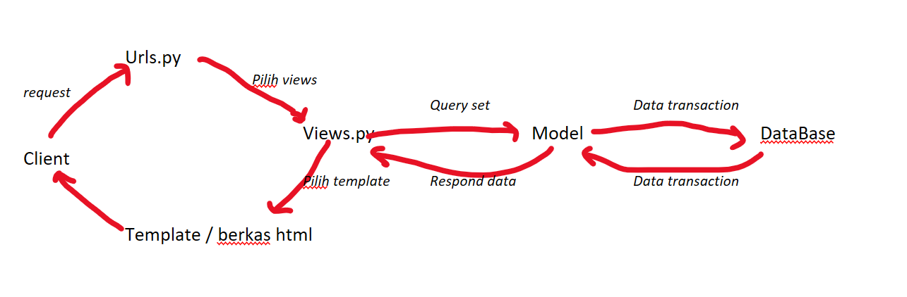
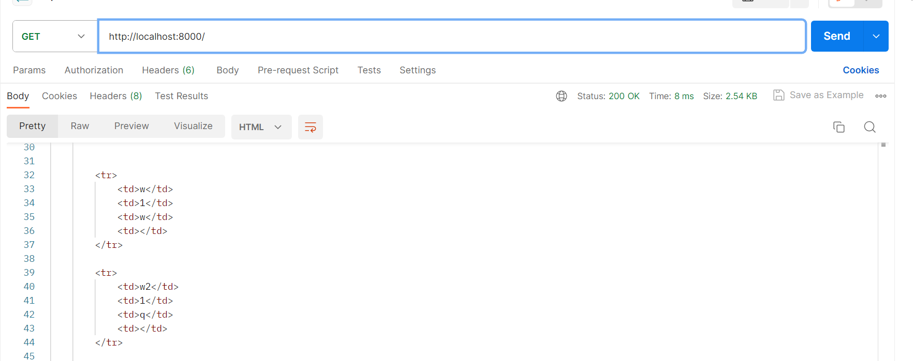
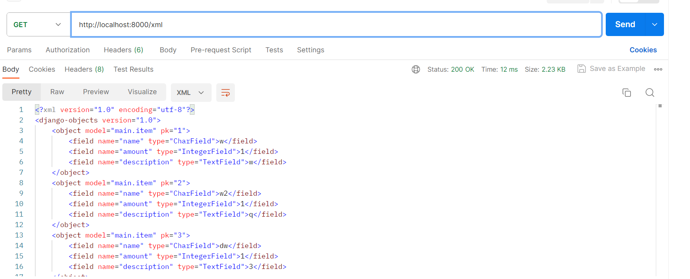
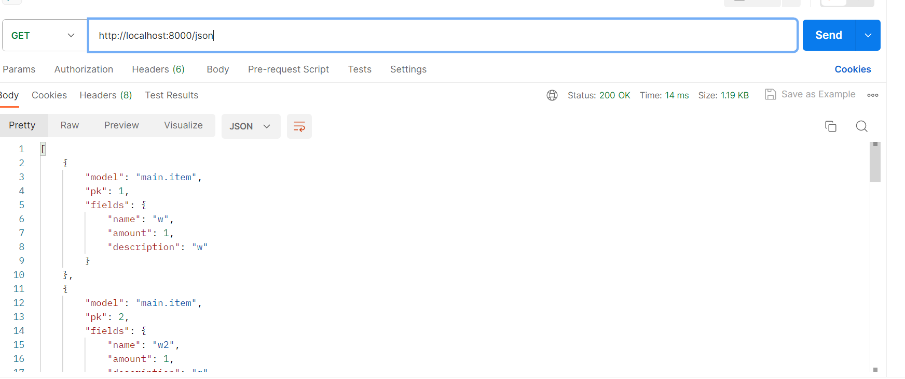
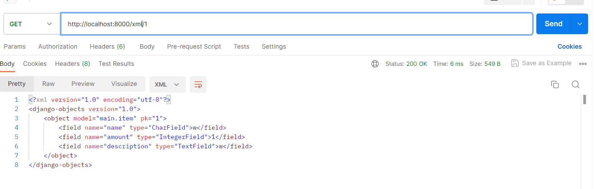
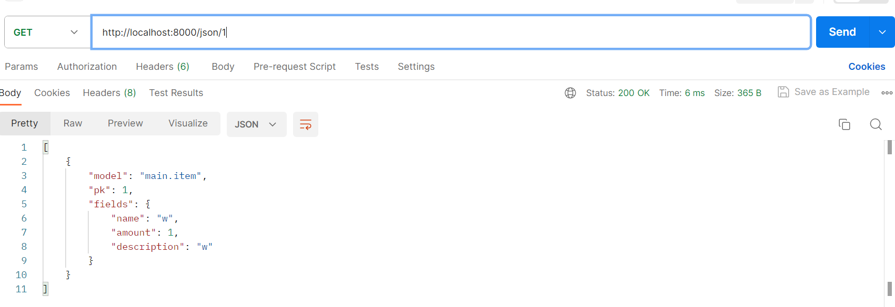

Link : (https://gabriella-naomi21-tugas.pbp.cs.ui.ac.id./)

<h1> Tugas 2 </h1>

<h2>Cara saya mengimplementaikan seluruh checklist </h2>
1. Saya membuat folder baru dengan nama Medicine_Stock pada lokal saya untuk menginisiasi repositori baru dan mengonfigurasi git pada folder ini. Saya juga membuat file README.md pada folder ini. Lalu saya membuat repository baru pada GitHub saya dengan visibilitas publik. Lalu saya membuat branch utama baru dan menghubungkan repository lokal saya dengan repository yang ada di GitHub saya kemudian melakukan push, sehingga file README saya sekarang sudah ada di repository GitHub saya. Setelah itu pada Git CMD saya, saya masuk ke direktori Medicine_Stock tadi lalu membuat dan menjalankan virtual environment. Lalu pada folder yang sama, saya membuat file requirements.txt yang berisi dependencies yang saya butuhkan untuk projek ini dan meng-install dependecies ini pada virtual environment. Lalu saya membuat projek django baru. Setelah itu, saya melihat bahwa ada kesalahan pada struktur file yang saya buat, sehingga saya membenarkannya dengan cara memastikan bahwa file README, requirements, manage, db.sqlite3 berada pada direktori utama, dan file init,asgi,settings,urls, dan wsgi pada direktori proyek. Lalu saya mengedit settings.py untuk mengizinkan semua host untuk bisa mengakses app. Lalu saya membuat berkas .gitignore pada direktori utama untuk mengabaikan berkas-berkas yang perlu diabaikan oleh Git. Setelah itu, saya melakukan add, commit, dan push untuk mengupdate repository GitHub saya agar sesuai dengan local saya setelah dilakukan perubahan. Lalu saya mendeploy app ini pada Adaptable

2. Setelah memastikan bahwa virtual environment masih aktif, pada direktori utama Medicine_Stock saya membuka aplikasi main dengan perintah python manage.py startapp main. Lalu saya mendaftarkan app main tadi dengan menambahkan 'main' pada variabel INSTALLED_APPS yang ada pada settings.py pada direktori proyek shopping_list.

3. Pada file urls.py yang ada pada direktori proyek, pada bagian urlpatterns kita tambahkan path('main/', include('main.urls')). Path ada fungsi yang digunakan untuk menyocokkan pola URL kemudian menjalankan fungsi views yang sesuai. Pada bagian ini, 'main/' adalah pola URL yang akan dicocokan sehingga jika pada URL ada 'main/' maka Django akan mencari file main.urls yang nantinya akan memetakan pola URL selanjutnya ke fungsi views yang sesuai.

4. Buka berkas models.py pada direktori main, di sini kita membuat model dengan nama Item. Melalui model ini kita mendefinisikan struktur basis data kita termasuk menentukan jenis dari masing-masing atribut yaitu name berupa CharField, amount berupa IntegerField dan description berupa TextField. Lalu saya melakukan migrasi model untuk melacak perubahan pada model basis data.

5. Kemudian saya membuka file views.py yang ada pada direktori main saya. Di sini, saya akan membuat function-function yang nantinya akan dipanggil jika pola URLnya sesuai. Pada project ini, saya membuat function show_main yang akan me-pass data name dan class ke template saat dirender. Di sini saya membuat context yaitu sebuah dictionary yang menyimpan data yang akan kita pass ke template karena kita belum menggunakan model dan data base.Saya membuat direktori baru bernama templates pada direktori main yang berisi berkas main.html. Berkasi ini berisi nama aplikasi dan juga template tag yang nantinya akan digantikan dengan value dari data yang dirender pada views.

6. Setelah Django melakukan pengecekan pada urls yang ada di direktori proyek, jika terdapat pola 'main/' maka Django akan mengecek file urls yang ada pada direktori main. Maka saya membuat file urls.py pada direktori main. Lalu saya mengimport path dari django.urls dan juga function views yang ingin digunakan. Lalu saya juga mendefine app_main untuk memberikan nama unik untuk app itu pada URL nantinya. Lalu saya menggunakan fungsi path pada variabel urlpatterns. Fungsi path ini menerima 3 argumen, yang pertama adalah pola URL yang akan dicocokan nantinya dalam hal ini polanya adalah '' (string kosong) sehingga maksudnya adalah home page dari app main itu sendiri, lalu fungsi pada views yang akan dipanggil jika pola URLnya sesuai (akan dipanggil fungsi show_main jika setelah /main adalah string kosong), kemudian name (ini opsional) supaya jika kita ingin merujuk pada URL ini pada bagian lain dari file ini, kita hanya perlu menyebut nama saja, tanpa perlu menuliskan URL lengkapnya.

7. Karena saya sudah melakukan deployment dari awal, saya hanya perlu melakukan add,commit, push direktori utama Medicine_Stock secara keseluruhan sehingga seluruh perubaha yang saya lakukan pada local akan tercatat pada direktori GitHub saya. Setelah itu Adaptable akan otomatis melakukan deployment ulang saat ada perubahan pada GitHub sourcenya.


<h2>Bagan request client ke web aplikasi berbasis Django beserta responnya </h2>


Jadi saat client mengirimkan request berupa sebuah URL, URL ini akan diterima dan dicek polanya oleh urls.py. Kemudian, jika ada pola yang sesuai dengan URL request, maka akan dikirimkan views yang sesuai. Lalu views akan menampilkan template yang sesuai dengan requestnya. Jika ternyata views butuh data dari database, maka dia akan sampaikan ke model untuk merequest data yang dibutuhkan. Lalu model akan membuat struktur data sesuai dengan request dan akan meminta data ke database, sehingga hanya data yang dibutuhkan saja yang kita ambil dari database. Kemudian data tersebut akan dikirimkan ke model, dan model akan mengirimkan data tersebut ke views, lalu views akan merender data tersebut ke html sehingga nantinya data tersebut akan muncul pada halaman web sesuai dengan template htmlnya. Lalu webpage akan dikembalikan dan ditampilkan kepada client.

<h2> Alasan menggunakan virtual environment </h2>
Alasan kita menggunakan virtual environment adalah untuk mengisolasi projek kita dengan proyek lainnya sehingga setiap proyek memiliki environmentnya sendiri. Hal ini dapat menghindarkan kita dari konflik dependensi seandainya kita mengerjakan beberapa proyek yang berbeda secara bersamaan atau ketika proyek-proyek kita menggunakan versi Django atau versi python yang berbeda.

Memungkinkan untuk membuat aplikasi web berbasis Django tanpa menggunakan virtual environment, namun best practicenya adalah menggunakan virtual environment untuk menghindari masalah-masalah yang nantinya akan mungkin muncul dan juga untuk menjada lingkungan pengembangan python tetap tertatur, bersih, dan aman.

<h2> MVC, MVT, dan MVVM </h2>
MVC (Model-View-Controller), MVT (Model-View-Template), dan MVVM (Model-View-ViewModel) adalah pola arsitektur perangkat lunak yang menerapkan prinsip separation of concern. Prinsip ini memisahkan perangkat lunak menjadi beberapa komponen yang mana masing-masing komponen bertanggung jawab untuk suatu askpek dalam perangkat lunak. Perbedaan di antara ketiga arsitektur ini adalah cara mereka menerapkan separation of concern atau cara mereka memisahkan komponen pada perangkat lunaknya sehingga ada beberapa komponen yang berbeda.

MVC (Model-View-Controller):<br>
    - Model = berhubungan dengan data <br>
    - View: berhubungan dengan user interface dan menampilkan data <br>
    - Controller : Mengontrol application flow dan user input <br>
MVT (Model-View-Template): <br>
    - Model = berhubungan dengan data <br>
    - View: berhubungan dengan user interface dan menampilkan data <br>
    - Template : Bertanggung jawab untuk HTML rendering (mengatur tampilan) dan menggabungkan data dari Model dan View ke dalam HTML <br>
MVVM (Model-View-ViewModel)
    - Model = berhubungan dengan data <br>
    - View: berhubungan dengan user interface dan menampilkan data <br>
    - ViewModel : Berperan sebagai perantara antara Model dan View. ViewModel bertanggung jawab untuk menyiapkan data untuk view dan memperbarui view saat data berubah. <br>

Perbedaan utama dari ketiganya adalah pada komponen controller pada MVC, template pada MVT dan ViewModel pada MVVM

<h1> Tugas 3 </h1>

<h2> Perbedaan antara form POST dan GET dala, Django </h2> 
1. Metode Pengiriman Data dan Keamanan <br>
* POST : Data dikirimkan sebagai bagian dari body permintaan HTTP tidak terlihat dalam URL <br>
* GET : Data dikirimkan sebagai parameter di URL <br>

2. Penggunaan
* POST : Digunakan ketika ingin mengirimkan data yang akan memengaruhi perubahan di server
* GET : Digunakan ketika ingin mengambil data dari server 

3. Keamanan
* POST : Lebih aman karena data tidak terlihat dalam URL
* GET : Kurang aman karena data dapat dilihat pada URL 

4. Penangan Data:
* POST : Ditangani oleh view Django yang menggunakan metode request.POST atau request.FILES (jika ada unggahan file)
* GET : Ditangani oleh view Django yang menggunakan metode request.GET 

<h2>  Perbedaan utama antara XML, JSON, dan HTML dalam konteks pengiriman data </h2>
1. XML : Menggunakan tag pembuka dan penutup untuk mengelilingi data (mirip seperti HTML). Setiap elemen atau node memiliki struktur hierarki yang jelas. Struktur ini berbentuk seperti struktur pohon yang dimulai dengan elemen akar/induk baru kemudian elemen anak. <br>
2. JSON : Menggunakan pasangan key dan values dalam tanda kurung kurawal sehingga lebih mudah dibaca oleh manusia. <br>
3. HTML : tidak secara khusus dirancang untuk pengiriman data. Namun, bisa digunakan untuk mengirimkan data dalam bentuk formulir. HTML lebih sering digunakan untuk membuat struktur halaman web. <br>

<h2> Alasan JSON sering digunakan dalam pertukaran data antara aplikasi web modern </h2>
1. Memiliki sintaks yang sederhana dan mudah dibaca oleh manusia <br>
2. JSON memiliki overhead yang rendah dalam hal ukuran data sehingga lebih ringan dan cepat dalam pengiriman data <br>
3. JSON bisa dipahami oleh hampir semua bahasa pemrograman <br>
4. JSON mendukung berbagai tipe data (termasuk array) sehingga dapat menggambarkaan data yang kompleks dan dinamis dengan mudah.

<h2> Cara saya mengimplementasikan seluruh checklist</h2>

<h4> Membuat input form </h4>

Pertama saya membuat berkas form.py yang digunakan untuk membuat sebuah form dengan menggunakan kelas ModelForm berdasarkan model Item. Disini saya membuat kelas ProductForm yang mewarisi semua fitur dan fungsi dari kelas ModelForm. Lalu saya membuat kelas Meta yang di dalamnya memuat model yang akan menjadi dasar pembuatan form, dan juga menentukan bidang-bidang dari model Item yang akan dimasukkan dalam form ini.

Lalu saya membuat fungsi create_product pada file views.py yang ada di folder main yang menerima parameter request. Lalu saya membuat instance dari ProductForm. request.POST digunakan untuk mengisi form yang dikirimkan oleh pengguna dengan metode POST dan none untuk membuat form kosong ketika halaman pertama kali diakses.

Lalu saya membuat kondisi bahwa form hanya akan diproses jika data yang dikirimkan valid sesuai dengan yang didefinisikan pada ProductForm dan requestnya adalah POST. Setelah data berhasil disimpan, pengguna akan dibawa kembali ke home page. Jika requestnya adalah GET atau form tidak valid, maka akan merender form ini ke halaman create_product.html. Halaman ini berisi form yang memungkinkan pengguna untuk mengisi form.

Lalu ditambahkan url untuk memanggil fungsi create_product.

<h4> Membuat 5 fungsi </h4>
HTML : disini saya mengedit fungsi show_main sehingga merender juga seluruh item yang sudah disimpan di database. Kemudian pada main.html, saya tampilkan seluruh atribut dari item-item yang sudah dibuat tadi. <br>

XML : disini saya membuat fungsi show_xml yang mengambil seluruh data item yang sudah disimpan dalam database, kemudian menserialize menjadi format xml, lalu dikembalikan HttpResponse dengan content_type yang mengindikasikan bahwa response berisi data dalam format XML

JSON : disini saya membuat fungsi show_json yang mengambil seluruh data item yang sudah disimpan dalam database, kemudian menserialize menjadi format JSON, lalu dikembalikan HttpResponse dengan content_type yang mengindikasikan bahwa response berisi data dalam format JSON.

XML by ID : disini saya membuat fungsi show_xml_by_id yang menerima parameter request dan id. Fungsi ini engambil satu item berdasarkan ID yang ditentukan, kemudian menserialize menjadi format xml, lalu dikembalikan HttpResponse dengan content_type yang mengindikasikan bahwa response berisi data dalam format XML

JSON by ID : disini saya membuat fungsi show_json_by_id yang menerima parameter request dan id. Fungsi ini engambil satu item berdasarkan ID yang ditentukan, kemudian menserialize menjadi format JSON, lalu dikembalikan HttpResponse dengan content_type yang mengindikasikan bahwa response berisi data dalam format JSON

<h4> Membuat routing URL </h4>
Lalu saya menambahkan URL routing untuk masing-masing fungsi view (yang belum ada routingnya) pada urls.py pada main folder dengan menggunakan path() sebagai berikut :
    <pre>
    ```
    path('xml/', show_xml, name = 'show_xml'),
    path('json/', show_json, name = 'show_json'),
    path('xml/<int:id>/', show_xml_by_id, name='show_xml_by_id'),
    path('json/<int:id>/', show_json_by_id, name='show_json_by_id'), 
    ```
    </pre>

<h2> Screenshoot </h2>
HTML :



XML :


JSON:


XML by ID :


JSON by ID :




<h1> Tugas 4 </h1>
<h3> Django UserCreationForm</h3>
Salah satu dari banyak formulir bawaan Django yang digunakan khususnya untuk membuat akun pengguna baru (formulir register).

Kelebihan :
1. Mudah digunakan dan membuat developer tidak perlu membuat form dari awal
2. Integrasi dengan Authentication 
3. Konfigurasi dapat dikustomisasi = dapat menambahkan atau menghapus bidang yang diperlukan dalam formulit.

Kekurangan:
1. Tampilan bawaan sederhana = harus membuat template sendiri untuk tampilan yang lebih menarik
2. Terbatas dalam validasi = untuk keamaan tambahan
3. Tidak menangani seluruh alur registrasi = untuk alur regisitrasi yang lebih kompleks seperti verifikasi email, perlu code tambahan

<h3> Autentikasi vs Otorisasi</h3>
Autentikasi = proses untuk mengidentifikasi user yang mencoba login. Ini adalah cara untuk memverifikasi user apakah user yang mencoba login benar-benar sesuai.
<br>
Otorisasi adalah proses untuk memverifikasi apakah user yang telah diidentifikasi memiliki akses terhadap sesuatu. 

<br>
Alasan keduanya penting:

1. Keamanan : Autentikasi memastikan bahwa user yang login benar-benar sesuai dan sah. Otorisasi memastikan bahwa user hanya dapat melakukan tindakan sesuai yang diizinkan sehinga dapat menghindari penyalahgunaan.

2. Pengalaman pengguna : Autentikasi memungkinkan aplikasi mengenali pengguna dan sehingga dapat memberikan pengalaman sesuai preferensi atau riwayat pengguna.  Otorisasi memastikan bahwa pengguna hanya melihat dan dapat mengakses bagian-bagian yang relevan untuk mereka.

<h3> Cookies </h3>
Cookies adalah sejenis data yang disimpan di sisi klien yang digunakan untuk menyimpan informasi yang dapat diakses oleh web server ketika melakukan request. Cookies dapat digunakan untuk melakukan holding state sehingga user tidak perlu melakukan login saat masih mengakses halaman website yang sama. Dalam hal ini, cookie akan menyimpan Session ID pada kompiter klien. Pada server session ID ini akan dipetakan pada ssuatu struktur data yang berisi informasi yang dibutuhkan.

<h3> Apakah penggunaan cookie dalam kondisi default aman dalam pengembangan web?</h3>

Dalam kondisi default, data yang dibawa cookie tidak dapat berubah saat berpindah, sehingga cookie tidak dapat mentransfer malware. Akan tetapi, ada beberapa risiko yang perlu diwaspadai ,contohnya jika data pada cookie tidak di enkripsi dengann benar maka informasi penting dalam cookie bisa diambil oleh pihak yang tidak sah. Dengan demikian, dapat terjadi kebocoran data pribadi, pencurian identitas, ataupun pelacakan pengguna jika Cookie berhasil dicuri.


<h3> Implementasi ceklist </h3>
<h4> Mengimplementasikan fungsi registrasi, login, dan logout </h4>

<h5> Fungsi Registrasi</h5>
melakukan import :
<pre>
    from django.shortcuts import redirect
    from django.contrib.auth.forms import UserCreationForm
    from django.contrib import messages  
</pre>

Lalu membuat fungsi register pada views.py yang ada pada app main. Fungsi ini membuat instance dari UserCreationForm. Ini adalah kelas yang bisa dipakai untuk membuat form formulir pendaftaran pengguna yang disediakan oleh Django. Jika ada request methode yang POST, kode ini akan memeriksa apakah formnya valid, jika falid, maka data yang diisikan oleh pengguna akan disimpan ke database. Sehingga pengguna dengan nama penggunna dan password tersebut sudah terdaftar di database. Jika berhasil, maka pesan sukses akan ditampilkan dan akan dibawa ke halama login.

Kemudian saya membuat berkas register.html pada folder template yang ada di aplikasi main yang berfungsi sebagai struktur halaman register ini. Lalu saya membuat URL routing untuk mengakses fungsi register tadi.

<h5> Fungsi login </h5>
Saya membuat fungsi login_user pada views.py yang ada di aplikasi main. Fungsi ini akan memeriksa apakah requestnya adalah POST, jika benar maka fungsi ini akan mengambil data username dan passwor yang dimasukkan oleh pengguna lalu mencocokannya dengan data yang ada di database. Jika cocok maka objek pengguna akan ditemukan. Jika penggunanya valid maka pengguna tersebut akan dijinkan masuk kehalaman show_main. Jika tidak, maka akan dikeluarkan pesan gagal dan akan kembali ke halaman login.

Lalu saya membuat berkas login.html pada folder templates yang ada pada aplikasi main. Halaman ini yang akan menjadi struktur dari halaman login yang akan meminta input username dan password dari user yang ingin login. Lalu saya membuat URL routing ke fungsi login_user ini pada file urls.py pada app main

<h5> Fungsi logout </h5>
Saya mengimport hal-hal yang diperlukan lalu membuat fungsi logout_user pada berkas views.py pada aplikasi main. Fungsi ini akan menghapus sesi pengguna jika dipanggil dan akan mengembalikannya ke halaman login.

Lalu saya membuat button baru yang bertuliskan logout yang jika di klik akan membawa ke url routing dengan nama logout. Lalu saya membuat url routing dengan nama logout yang akan memanggil fungsi logout_user pada urls.py di aplikasi main.


Lalu saya merestriksi akses halaman main dengan memastikan bahwa halaman main hanya dapat diakses oleh pengguna yang sudah login.


<h4> Menghubungkan model Item dengan User </h4>
Lalu saya membuat field user pada model yang menyimpan referensi ke objek User dengan menggunakan modells.ForeignKey(). Dengan demikian setiap item akan terhubung dengan 1 user.

Lalu saya mengubah fungsi create_product() yang ada pada views.py pada app main. Fungsi ini diubah menjadi tidak akan langsung menyimpan data dari form ke database sehingga bisa dimodifikasi dahulu. Dalam hal ini, field user akan dimodisikasi sehingga berisi user yang sedang login. Baru kemudian disimpan dalam data base dan dikembalikan ke halaman main.

Lalu saya melakukan migrasi model dan menerapkan migrasi tersebut.

<h4> Menampilkan detail username dan cookies seperti last login</h4>
Mengubah fungsi dari show_main sehingga hanya menampilkan data yang terhubung dengan user yang sedang login dan juga mengganti nama menjadi sesuai dengann username.

Lalu untuk menggunakan data lastlogin dari cookies, saya mengimport beberapa hal yang diperlukan pada views.py yang ada di app main. Lalu pada fungsi login_user saya menambah fungsi untuk menambahkan cookies yang bernama last_login yang akan berisi informasi kapan terakhir kali user login. 

Lalu pada fungsi show_main bagian context, saya membuat variabel last_login yang akan berisi data dari cookie yanng bernama last_login yang didapatkan dari request.Lalu saya juga menambahkan potongan code yang berfungsi untuk menghapus cookie jika pengguna sudah logout pada fungsi logout_user. Kemudian menampilkan informasi last login ini pada file html.

<h4> Membuat 2 user dengan 3 dummy data </h4>
Saya membuat user dengan masuk ke laman register, kemudian login dan membuat 3 produk dengan menggunakan tombol add product

<h1> Tugas 5 </h1>
<h4> Steps </h4>
1. Saya menambahkan tag agar halaman web bisa menyesuaikan ukuran dan perilaku sesuai perangkat<br>
2. Saya menambahkan bootstrap. Saya menggunakan file CSS dari JsDelivr CDN yang bisa digunakan untuk umum. Lalu saya juga menambahkan link ke file javascript<br>
3. Setelah style dari file itu terapply di web saya, saya mengubah beberapa tampilan pada halaman login, register dan juga main saya.<br>
4. Pada halaman login, saya menggunakan beberapa class yang sudah diberikan oleh CSS seperti container lalu juga ada btn primary untuk mengedit button menjadi warna bitu. Saya juga membuat beberapa kelas baru agar bisa memodifikasi halaman login saya sesuai keinginan saya ,seperti string-login untuk memodifikasi huruf yg ada di halaman ini, lalu class wrap.login untuk sebagai container yang aka wrap elemen-elemen login dan lain sebagainya.<br>
5. Kemudian, pada halaman main, saya menambahkan navbar berdasarkan dokumentasi bootstrap. Pada navbar ini akan ditampilkan nama user, kelas user dan juga tombol logout serta tombol add new product. Disini saya juga membuat kelas baru yaitu "logout_button" untuk melakukan customisasi kedua tombol pada navbar. Lalu saya juga membagi halaman ini ke beberapa bagian untuk mengatur layoutnya. Saya juga mengubah font, serta membuat card untuk menampilkan daftar item. Di sini saya menggunakan class card yang saya modifikasi kembali agar cardnya sesuai dengan keingin saya. Saya juga membuat class card yang bisa mendeteksi apakah card ini ganjil atau genap sehingga dihasilkan card yang berbeda tampilan (selang-seling). Lalu saya juga membuat class card untuk card terahir agar bisa ditampilkan card yang berbeda dari lainnya. Pada class card ini juga dibagi menjadi 3 class lain, yaitu ada card-header, card-bodt dan card-footer yang masinh-masing menangani bagiannya sendiri. Pada card footer terdapat 3 button, yang untuk classnya saya meenggunakan class btn dari CSS dan juga btn sendiri untuk menambah margin.<br>
6. Pada halaman register, saya juga membagi halaman ini ke beberapa bagian. Kemudian saya juga melakukan customisasi beberapa class untuk membuat tampilan yang sesuai keingin saya. Saya juga menggunakan beberapa kelas yang saya  gunakan pada kelas login.<br>
7. Pada halaman add product pun saya mengimplementasikan hal yang sama dengan pada halaman register, bahkan beberapa menggunakan class yang dibuat untuk class register.<br>

<h4> Selector </h4>
1.Universal selector <br>
-Manfaat : untuk memilih semua elemen di dalam HTML<br>
-Penggunaan: Jika ingin memberikan gaya default pada semua elemen<br>

2.Type selector <br>
-Manfaat: Memilih semua elemen dengan tipe tertentu <br>
-Penggunaan: Saat ingin memberikan style yang sama untuk elemen tipe tertentu<br>

3.Class selector <br>
-Manfaat: dapat memberikan gaya yang sama untuk elemen yang memiliki atribut class tertentu<br>
-Penggunaan: Ketika ingin memberikan gaya elemen yang sama untuk suatu elemen dengan class tertentu.<br>

4.Id selector <br>
-Manfaat: Memberikan gaya untuk semua elemen dengan id yang sama<br>
-Penggunaan: Ketika ingin memberikan gaya elemen yang sama untuk suatu elemen dengan id tertentu.<br>

5.Pseudo-class Selector <br>
-Manfaat: Memilih elemen berdasarkan keadaan atau kondisi tertentu, seprti:'hover',dll<br>
-Penggunaan: Untuk memberikan gaya ke elemen dalam respons terhadap tindakan pengguna. <br>

6.Pseudo-element Selector 
-Manfaat: memungkinkan untuk memilih dan mengubah bagian tertentu dari elemen, seperti ::before atau ::after<br>
-Penggunaan:  untuk menambahkan konten atau dekorasi tambahan ke elemen, seperti tanda panah sebelum teks atau lapisan latar belakang di atas elemen.<br>

7.Attribute Selector <br>
-Manfaat: Unttuk memilih dan mengubah style berdasarkan atribut atau nilai atribut tertentu <br>
-Penggunaan: Jika ingin mengubah gaya elemen berdasarkan atribut atau nilai tertentu  <br>

8.Descendant selector <br>
-Manfaat: Memilih element turunan uang berada pada elemen induk <br>
-Penggunaan:ketika ingin mengatur gaya elemen turunan di dalam elemen induk tertentu. <br>

9.Child selector <br>
-Manfaat: memilih elemen yang menjadi anak langsung dari elemen induk tertentu, seperti .container > p untuk memilih semua elemen p yang menjadi anak langsung dari elemen dengan kelas .container.<br>
-Penggunaan: ketika ingin mengubah gaya elemen anak yang langsung berada dalam elemen induk tertentu<br>

10.Adjacent Sibling Selector <br>
-Maanfaat: memilih elemen yang menjadi saudara sejajar (bersebelahan) dengan elemen lain<br>
-Penggunaan: ketika ingin mengubah gaya elemen yang berada langsung setelah elemen lain.<br>

<h4> HTML5 Tag</h4>
1.header: Mendifinisikan bagian atas HTML <br>
2.nav: Mengelompokkan tautan navigasi, membantu membuat navbar <br>
3. h1,h2,h3..: Heading dalam dokumen HTML <br>
4. p: tag untuk menandakan paragraf<br>
5. a: untuk membuat tautan / hyperlink dalam HTML<br>
6. br: untuk line break<br>
7. div: divisi / wadah yang dapat mengelompokkan sekelompok elemen HTML<br>
8. ul: membuat daftar tak bernomor<br>
9. ol: membuat daftar bernomor<br>
10. li: M=mendefinisikan setiap elemen dalam daftar<br>
11. style: menyematkan CSS seacara langsung dalam HTML<br>
12. strog: memnebalkan tulisan<br>

<h4> Perbedaan margin dan padding</h4>
-Margin: Mengatur jarak antar elemen sehingga memperngaruhi tata letak berdasarkan jaraknya dengan elemen lain <br>
-Padding: Mengatur jarak antara elemen yang ada di dalam dengan containernya sendiri. 

<h4> Perbedaan Tailwind dan Bootstrap</h4>
-Tailwind membangun tampilan dengan menggabungkan kelas-kelas utilitas yang telah didefinisikan sebelumnya. Bootstrap menggunakan gaya dan komponen yang telah didefinisikan sehingga punya tampilan yang  bisa dipakai secara langsung. <br>
-Tailwind memiliki file CSS yang lebih kecil. Bootstrap memiliki file CSS yang lebih besar<br>
-Tailwind memiliki fleksibilitas yang tinggi. Boostrap menghasilkan tampilan yang lebih konsisten karena cenderung menggunakan komponen yang sudah ada.<br>
-Tailwind lebih sulit dipelajari. Bootstap lebih mudah dipelajari karena tinggal menggunakan komponen yang sudah ada.<br>

Penggunaan: <br>
-Pakai Bootstrap saat ingin mendesain web dengan bagus dan lebih mudah karena hanya perlu memakai komponen yang sudah ada. Cocok jika tampilan bukanlah hal yang utama dan konsistensi cukup diperhatikan. <br>
-Pakai Tailwind jika ingin melakukan banyak kustomisasi desain. Cocok digunakan untuk mengatur tampilan dengan cepat menggunakan kelas-kelas langsung di elemen HTML tanpa harus membuat banyak CSS kustom. <br>

<h1> Tugas 6 </h1>
<h4> Perbedaan antara asynchronous programming dengan synchronous programming </h4>
- Eksekusi Bersamaan<br>
1. Sync: tugas-tugas dieksekusi secara berurutan, satu demi satu. Jika tugas tertentu memakan waktu, maka seluruh eksekusi program akan terhenti sampai tugas tersebut selesai. <br>
2. Async:  tugas-tugas dapat dieksekusi secara bersamaan tanpa harus menunggu tugas sebelumnya selesai. Ini memungkinkan program untuk terus berjalan dan melakukan pekerjaan lain selama tugas yang memakan waktu sedang berlangsung. <br>

-Blocking vs. Non-blocking: <br>
1.Sync: Jika ada tugas yang memakan waktu akan memblokir eksekusi program <br>
2.Async: Tugas yang memakan waktu dieksekusi secara non-blocking sehingga eksekusi program tidak terhenti <br>

-Callback vs Await/Async: <br>
1.Sync:  menggunakan pemanggilan fungsi (function calls) secara linear untuk menjalankan tugas secara berurutan. <br>
2.Async : menggunakan async/await untuk mengelola tugas secara asinkronus <br>

-Lainnya <br>
1.Sync :Mudah dimengerti dan di-debug, sederhana untuk dikodekan <br>
2.Async: Meningkatkan responsivitas dan kinerja app yang membutuhkan banyak I/O, dapat mengelola banyak tugas bersamaan, cocok untuk pengembangan app jaringan <br>

<h4>  event-driven programming </h4>
Pendekatan di mana program membebrikan respons sesuai dengan interaksi yang dilakukan oleh pengguna. Jadi, program akan berjalan terus-menerus, lalu saat terjadi suatu peristiwa (aksi yang dilakukan user), barulah program merespons dengan respons yang sesuai.
<br>
Salah satu contohnya adalah atribut onclick pada button. Atribut ini berfungsi untuk menentukan tindakan yang akan dilakukan ketika button tersebut diklik

<h4>Penerapan asynchronous programming pada AJAX. </h4>
Dalam AJAX, asinkronus programming memungkinkan user untuk membuat request tanpa harus menunggu hasilnya, sehingga halaman web tetap responif selama proses tersebut berlangsung. <br>

Dalam hal ini kita menggunakan fungsi fetch untuk mengirim permintaan jaringan asinkron (misalnya, permintaan HTTP) ke server dan menangani respons yang diterima. Biasnya kita juga menggunakan async/await untuk membuat proses asinkrinus menjadi lebih clean

<h4> Perbedaan Fetch API dan library jQuery </h4>
Menurut saya penggunaan fetch API lebih baik karena fetch API mendukung konsep dan sintaks yang lebih modern dibandingkan dengan pendekatan jQuery. Selain itu, Fetch API menggunakan promise yang membuatnya menjadi lebih bersih dan mudah dibaca. Pengguaan promise ini juga memungkinkann kita untuk menggunakan metode .then() dan .catch() untuk menangani hasil dan kesalahan dengan lebih bersih dan terstruktur. Hal ini juga menghindari masalah callback hell yang sering terjadi pada jQuery. Fetch API juga memungkinkan kita untuk membuat permintaan HTTP header denga berbagai metode dan mengatur header dengan mudah.

<h4> Step by Step </h4>
- Ajax GET <br>
1. Pertama-tama saya membuat fungsi yang akan mengembalikan data json yaitu fungsi get_product_json pada views.py <br>
2. Lalu saya mangatur routing untuk fungsi ini pada urls.py di app main <br>
3. Saya mengubah format card container sehingga menjadi
```
div class="card-container" id ="item_card"
```
<br>
4. Kemudian pada main.html bagian paling bawah saya membuat block script dan membuat fungsi asinkronus bernama getProducts yang jika dipanggil akan melakukan pengambilan data dari url get_product_json. Setelah pengambilan data selesai dan didapat data berbentuk json, data diubah menjadi objek yang dapat digunakan dalam kode java script. <br>
5. Kemudian saya juga membuat fungsi asinkronus refreshProducts(). Fungsi ini akan memperbarui item denfan id item_card yang adalah class card container. Fungsi ini akan mengosongkan item dengan id "item_card" di HTML. Kemudian ada string HTML yang akan berisi daftar item. Setiap item adalah sebuah card. Lalu melakukan iterasi untuk semua data produk dan memasukkan informasi nama, jumlah, deskripsi ke dalam elemen div dengan class card dan menambahkannya ke dalam string HTML. Kemudian mengisi element HTML dengan id "item_card" dengan string HTML tadi. <br>
6. Saya juga memanggil function refreshProduct() ini dalam script agar selalu memanggil function ini setiap halaman ini dibuka, sehingga selalu merefresh denga data terbaru. <br>

-Ajax POST <br>
1.Membuat fungsi add_product_ajax untuk menambahkan produk ke database melalui permintaan POST menggunakan AJAX. Jika requestnya adalah POST, fungsi ini akan mengambil data nama, jumlah, description dari permintaan POST user lalu membuat objek ITEM baru. Lalu objek ini akan disimpan di database. Lalu akan dikembalikan httpresponse. Jika permintaan gagal akan dikembalkan httpresponnotfound <br>
2.Menambahkan routing untuk  function add_product_ajax pada urls.py pada app main <br>
3.Membuat modal sebagai form dengan bootstrap <br>
4.Lalu mengganti button "add product" pada navbar terdahulu sehingga mengimplementasikan ajax dan saat di klik terhubung dengan modal <br>
5.Lalu saya membuat function addProduct() yang akan melakukan request AJAX POST ke url add_product_ajax. Disini kita mengambil data dari elem formulit HTML dengan id form lalu mengirimkannya dalam bentuk objek FormData. Setelah itu  memanggil refrestProduct() untuk melakukan refresh halaman. Disini juga kita mengirim data formulir ke views add_product_ajax Django untuk pemrosesan lebih lanjut.Lalu melakukan reset form <br>
6.Kemudian kita mengatur agar button add product dalam form saat di klik akan memanggil function addProduct()

-Perintah collectstatic <br>
1.Pada settings.py kita mengatur STATIC_URL (URL ke akses ke file statis), STATIC_ROOT (lokasi file-file dikumpulkan). Lalu menjalan kan perintah
```
python manage.py collectstatic

```

